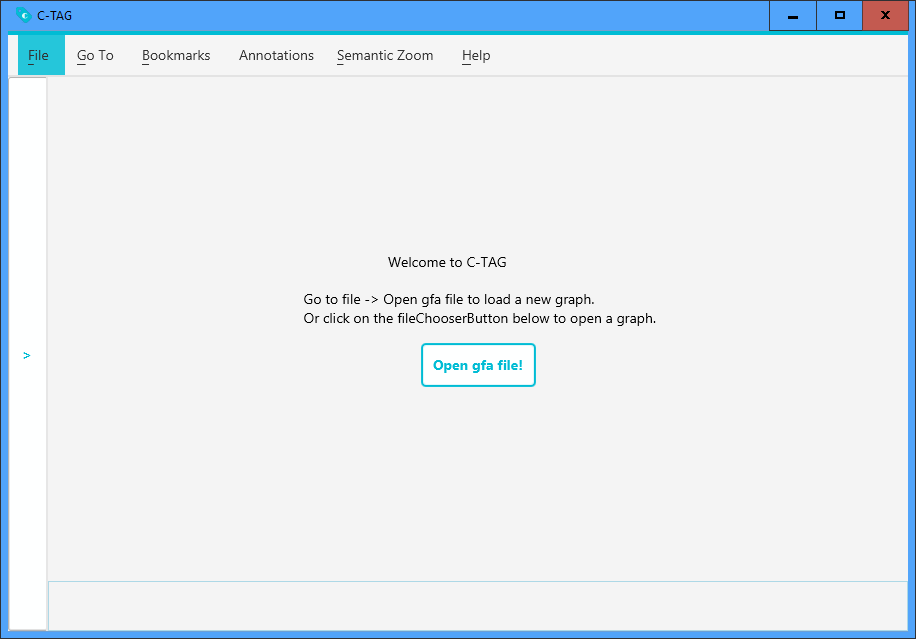
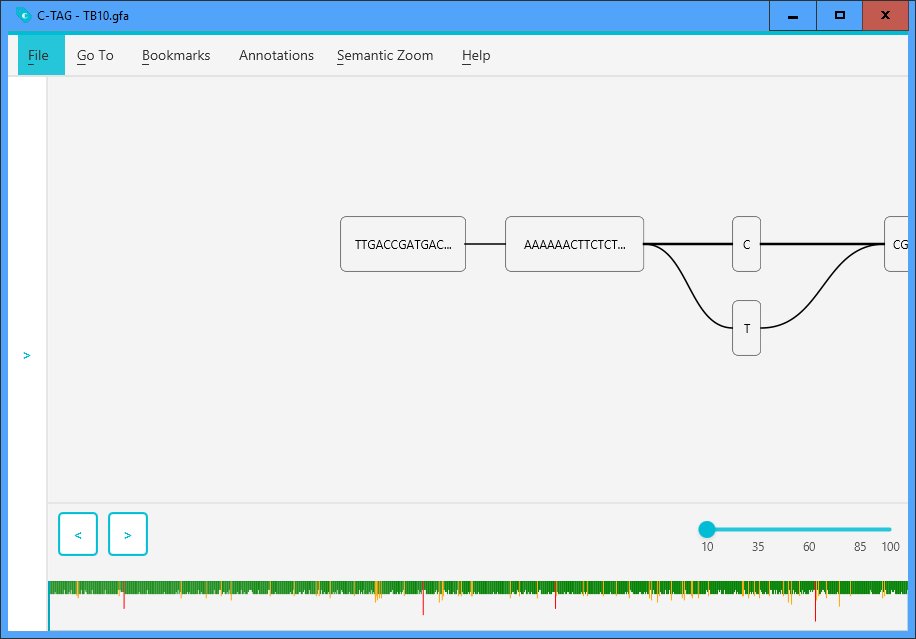
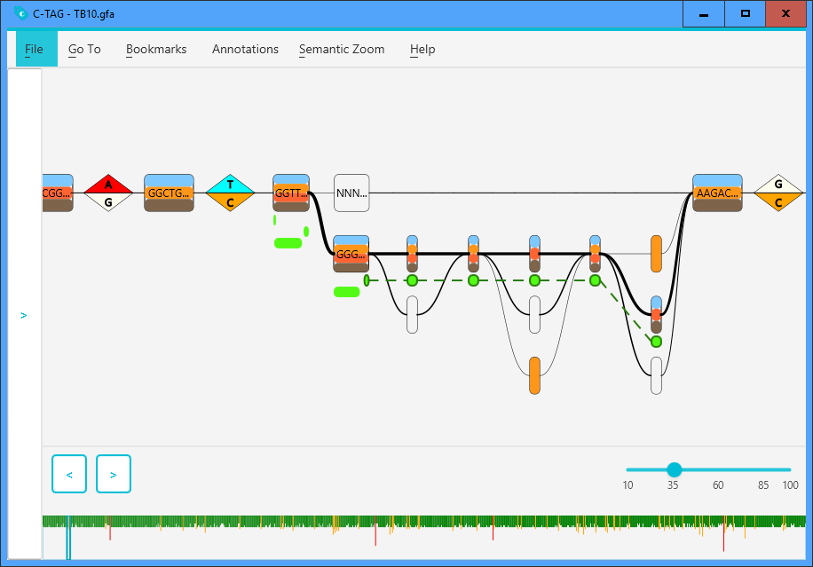

A genome population graph visualizer made by TU Delft students under direction of T. Abeel

## Getting Started
To get started, first [download](#download) one of the JARs tagged in our repository. Preferably, take the latest built JAR.
To start the application, simply double click the downloaded JAR.
If this doesn't start your application, it probably means you will need to have [JRE 1.8 installed](http://www.oracle.com/technetwork/java/javase/downloads/jre8-downloads-2133155.html).

Upon starting the application, you should be taken to the following screen:

From here out, you can open a GFA file in the visualizer, open additional feature files (GFF) etc.
After opening your first GFA file, you should be taken to this screen: 

## Features
Features of C-TAG include:
- Basic population graph drawing in the form of a left-to-right graph.
- Basic and intuitive controls to navigate through the graph.
- Genome colouring to show how subsets of genomes run through the graph and differ from each other.
- Bookmarks to store and share interesting positions in the graph.
- A heat-map to help identify dense sections of the graph.
- Semantic zooming to remove trivial bubbles, indels and chains from the graph.
- GFF Feature loading, filtering and searching to jump to a known trait instantly.

## Known issues
- Jumping often or far into the graph causes graph loading to fail. A workaround is to pan the part of interest out of view once close and pan back again.
- Annotations get drawn too close to nodes and may overlap with nodes beneath them.

## Built With
* [Maven](https://maven.apache.org/) - Dependency Management 

## Download
The latest download can be found

## Authors
Chris Lemaire
Just van Stam 
Stijn Swart
Maaike Visser
Cédric Willekens

## Acknowledgments
* Thanks to [Hygene](https://github.com/ProgrammingLife2017/hygene)
and [DynamiteAndButterflies](https://github.com/ProgrammingLife2017/DynamiteAndButterflies)
for letting us have a good example to go from.
